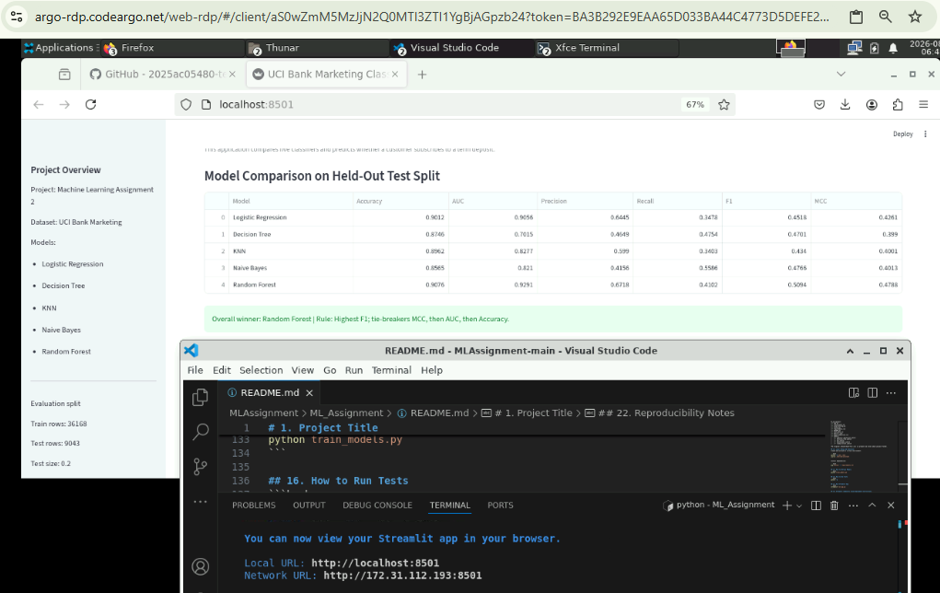

# 1. Project Title
# Machine Learning Assignment 2: UCI Bank Marketing Classification Dashboard

**Student ID:** 2025ac05480

## 2. Problem Statement
The goal is to predict whether a bank customer subscribes to a term deposit using the UCI Bank Marketing dataset. This project trains and compares five classification models, evaluates them using required metrics, and provides a Streamlit application for interactive prediction and result inspection.

## 3. Dataset Description
- Dataset name: UCI Bank Marketing (local file: `bank-full.csv`)
- Source link: https://www.kaggle.com/datasets/adityamhaske/bank-marketing-dataset
- Actual rows: 45,211
- Actual columns: 17
- Predictor features (excluding target): 16
- Target column: `y`
- Target classes: `no`, `yes`
- Class distribution:
  - `no`: 39,922
  - `yes`: 5,289
- Numerical features: `age`, `balance`, `day`, `duration`, `campaign`, `pdays`, `previous`
- Categorical features: `job`, `marital`, `education`, `default`, `housing`, `loan`, `contact`, `month`, `poutcome`

## 4. Assignment Requirement Validation
- Instances >= 500: satisfied (45,211)
- Input features >= 12: satisfied (16)

## 5. Data Preprocessing
- Column names are normalized by trimming whitespace.
- Target values are validated to ensure only `yes` and `no` are present.
- Target encoding is applied as `no -> 0`, `yes -> 1`.
- Numerical columns use median imputation.
- Categorical columns use most-frequent imputation.
- Categorical encoding uses `OneHotEncoder(handle_unknown="ignore")`.
- For compatibility with Gaussian Naive Bayes, encoded output is dense.
- Numeric scaling with `StandardScaler` is applied for Logistic Regression and KNN pipelines.
- Preprocessing is encapsulated inside each saved model pipeline so training and inference share identical transformations.

## 6. Train/Test Split and Leakage Prevention
- Split used:
  - `test_size=0.20`
  - `random_state=42`
  - `stratify=y`
- The split is performed once and reused for all five models.
- Preprocessing is fit only on training data.
- Uploaded Streamlit CSV data is never used for fitting or retraining.
- `test_data.csv` contains only held-out raw features (no target).
- True held-out labels are saved separately in `artifacts/test_labels.csv`.

## 7. Models Used
The implementation follows the five models explicitly enumerated in the assignment brief:
1. Logistic Regression
2. Decision Tree Classifier
3. K-Nearest Neighbors Classifier
4. Gaussian Naive Bayes
5. Random Forest Classifier

Note: The brief contains one mention of "6 models", but only five are explicitly named with table rows. This project implements exactly those five required models. The model registry design allows easy addition of a sixth model later if faculty clarifies.

## 8. Evaluation Metrics
- Accuracy: fraction of total correct predictions.
- AUC (ROC AUC): ranking quality using positive-class probabilities.
- Precision: proportion of predicted positives that are correct.
- Recall: proportion of actual positives correctly identified.
- F1 Score: harmonic mean of Precision and Recall.
- MCC: balanced correlation-style score in [-1, 1], useful for imbalanced classes.

## 9. Model Comparison
Held-out test split results:

| Model | Accuracy | AUC | Precision | Recall | F1 | MCC |
| --- | ---: | ---: | ---: | ---: | ---: | ---: |
| Logistic Regression | 0.901250 | 0.905574 | 0.644483 | 0.347826 | 0.451811 | 0.426058 |
| Decision Tree | 0.872830 | 0.700865 | 0.458182 | 0.476371 | 0.467099 | 0.395027 |
| KNN | 0.896163 | 0.827721 | 0.599002 | 0.340265 | 0.433996 | 0.400128 |
| Naive Bayes | 0.856464 | 0.821040 | 0.415612 | 0.558601 | 0.476613 | 0.401317 |
| Random Forest | 0.906668 | 0.929331 | 0.666149 | 0.405482 | 0.504113 | 0.473102 |

## 10. Model Observations
- Logistic Regression: strong precision and AUC, but lower recall reduced F1.
- Decision Tree: recall is moderate, but AUC and MCC are lower than top models.
- KNN: good accuracy and precision, but low recall limits F1.
- Naive Bayes: highest recall among five models, but lower precision/accuracy.
- Random Forest: best F1, best MCC, and best AUC among all models.

## 11. Overall Winner
- Winner: Random Forest
- Rule: highest F1; if tied, highest MCC; if still tied, highest AUC; if still tied, highest Accuracy.

## 12. Streamlit Application Features
- CSV upload for test data.
- Model selection dropdown with exactly five models.
- Metric cards for Accuracy, AUC, Precision, Recall, F1, MCC.
- Confusion matrix heatmap and classification report.
- Prediction output with class labels and probabilities.
- CSV download for prediction results.
- Uses stored held-out metrics by default and recalculates metrics when uploaded CSV includes true target labels.

## 13. Project Structure
```text
ML_Assignment/
|-- app.py
|-- train_models.py
|-- preprocessing.py
|-- config.py
|-- requirements.txt
|-- README.md
|-- test_data.csv
|-- metrics.json
|-- model_comparison.csv
|-- models/
|   |-- logistic_regression.joblib
|   |-- decision_tree.joblib
|   |-- knn.joblib
|   |-- naive_bayes.joblib
|   |-- random_forest.joblib
```
The original sataset(bank-full.csv) is present one level above project folder.

## 14. Local Setup and Execution
Create and activate a virtual environment:

```bash
python -m venv .venv
source .venv/bin/activate
```

Install dependencies:

```bash
pip install -r requirements.txt
```

## 15. How to Retrain Models
```bash
python train_models.py
```

## 16. How to Run Tests
```bash
pytest -q
```

## 17. Run Streamlit App
```bash
streamlit run app.py
```

## 18. Streamlit Community Cloud Deployment Instructions
1. Push this project folder to GitHub.
2. In Streamlit Community Cloud, select the repository and branch.
3. Set app entry point to `app.py`.
4. Deploy and verify by uploading `test_data.csv` and testing all five model selections.

## 19. GitHub Repository Link Placeholder
https://github.com/2025ac05480-tech/MLAssignment/tree/main

## 20. Live Streamlit Application Link Placeholder
https://mlassignment-xebabgvvabmxz3xdzzsxcp.streamlit.app/

## 21. BITS Virtual Lab Evidence Placeholder
 


## 22. Reproducibility Notes
- Fixed seeds are used with `random_state=42` where supported.
- Train/test split and schema metadata are stored in `artifacts/`.
- Saved pipelines include preprocessing and model steps, ensuring consistent inference.

## 23. Academic Integrity Statement
This implementation and the reported results were produced from local execution for this assignment submission. Any external references used for background understanding should be properly credited.

## 24. Limitations
- The task is binary classification with one fixed train/test split; cross-validation is not included.
- No advanced hyperparameter tuning is performed by design, to keep the solution lightweight and explainable.
- Model quality depends on this dataset and may change on other populations or time periods.